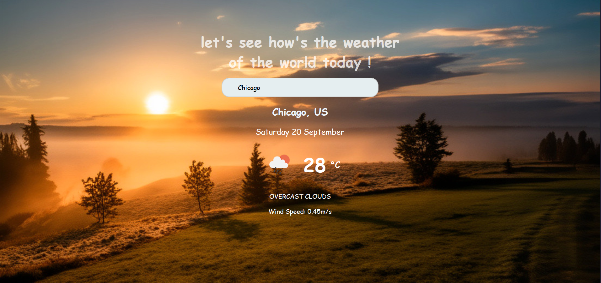

# Weather-Forecast-React

This is a React Weather App that shows the current weather, temperature, wind speed, and weather description for cities around the world — including Tehran, Iran. It’s still a work in progress because I’m fixing a small issue with the loading spinner.

---

## Author

Yasin Tajali

- GitHub: [YT-Coder66](https://github.com/YT-coder66/)
    
- LinkedIn: [Linkedin-Page](https://www.linkedin.com/in/yasin-tajali-malek-jahan-reactdev/)

- Email: pr0grmer6cd@gmail.com

---

---

## Features

- Search weather by city name
- Display current temperature, weather condition, humidity, wind speed, etc.a
- Error handling for invalid city names or network issues
- Responsive design for all screen sizes
- Simple, clean UI with intuitive UX

---

## How It Works

- User enters a city name in the search bar.

- The app fetches weather data from OpenWeatherMap API.

- Displays weather info with dynamic icons.

- Shows loading spinner while fetching.

- Handles errors gracefully.

- Mobile-friendly with responsive design.

---

## Technologies Used

- React 18+

- Fetch API / Axios

- CSS Modules or plain CSS

-  OpenWeatherMap API

---

## Getting Started

### Prerequisites

- Node.js (v14+)
- npm or yarn

---

### Installation

## bash
- git clone https://github.com/yourusername/react-weather-app.git
- cd react-weather-app
- npm install

---

## Running the Project
- npm run dev

--

## License

- MIT License